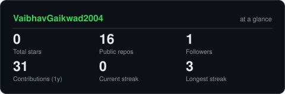
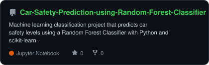
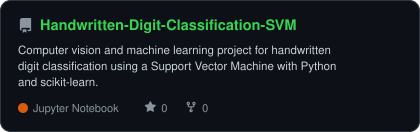
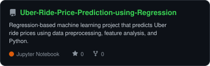
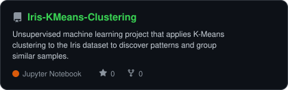

<div align="center">

# Hi, I'm Vaibhav Gaikwad 👋

### AI / ML Engineer • Data Science • Machine Learning

<p>
  
</p>

<p>
  <a href="https://github.com/VaibhavGaikwad2004">
    
  </a>
  <a href="https://www.linkedin.com/">
    
  </a>
</p>

</div>

---

## 👨‍💻 About Me

I'm Vaibhav, an AI/ML and Data Science enthusiast interested in building practical machine learning solutions.

* 🤖 Exploring Machine Learning, Data Science and Generative AI
* 📊 Working with data analysis, visualization and predictive modeling
* 🧠 Building projects across classification, regression and clustering
* 🚀 Continuously learning and improving my AI/ML engineering skills

---

## 🛠️ Tech Stack

<p align="center">
  
</p>

<p align="center">

`NumPy` • `Pandas` • `Matplotlib` • `Seaborn` • `Scikit-learn`

</p>

--- 
## 🎯 Skills & Languages

<p align="center">
  
  
</p>

---

## 📊 Machine Learning Projects

<p align="center">

| Project                             | Technique                    |
| ----------------------------------- | ---------------------------- |
| 🚗 Car Safety Prediction            | Random Forest Classification |
| ✍️ Handwritten Digit Classification | SVM                          |
| 🚕 Uber Ride Price Prediction       | Regression                   |
| 🌸 Iris Clustering                  | K-Means                      |

</p>

---

## 📈 GitHub Stats

<p align="center">
  
</p>

---

## 📊 GitHub Analytics

<p align="center">
  
</p>

<p align="center">
  
</p>

---

## 🚀 Featured Projects

<p align="center">





<br/>





</p>

---

## 🧠 Currently Exploring

```text
Machine Learning
       ↓
Data Science
       ↓
Deep Learning
       ↓
Generative AI
       ↓
AI Engineering
```

---

## 🐍 Contribution Activity

<p align="center">
  
</p>

---

## 📫 Connect With Me

<p align="center">

<a href="https://github.com/VaibhavGaikwad2004">
  
</a>

<a href="www.linkedin.com/in/vaibhav-gaikwad-962a61276">
  
</a>

</p>

---

<div align="center">

### Thanks for visiting my profile! 🚀

</div>
